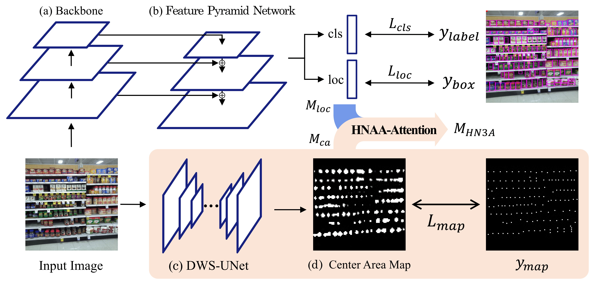
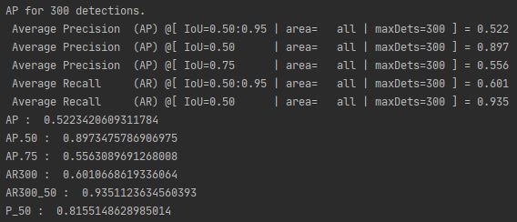

# Densely-packed Object Detection via Hard Negative-Aware Anchor Attention

An official code of Densely-packed Object Detection via Hard Negative-Aware Anchor Attention in WACV2022

Paper : https://openaccess.thecvf.com/content/WACV2022/papers/Cho_Densely-Packed_Object_Detection_via_Hard_Negative-Aware_Anchor_Attention_WACV_2022_paper.pdf



## Dataset

- SKU110k dataset : https://github.com/eg4000/SKU110K_CVPR19
- download ,unzip and build a structure like bellows

```
SUK110K_fixed (root)
            |-- SUK110K_fixed
                            |-- images
                                    |-- test_0.jpg
                                    |-- ...
                            |-- annotations
                                    |-- annotations_test.csv
                                    |-- ...
                            |-- LICENSE.txt
```

## Pretrained file

- Download 'pretrained_model.pth.tar' from [here](https://livecauac-my.sharepoint.com/:u:/g/personal/csm8167_cau_ac_kr/ETzfgw5iIWFNg0ShH-gmXUEBJWqa7ZtsCngy7LLCoFkkBA?e=7iOfYk) (about 168MB)
- make './saves' folder and put it to './saves' folder.

## Quick Start

- Download dataset
- Download pretrained_model

```
# python test.py
usage: test.py [-h] [--data_root]

  -h, --help            show this help message and exit
  --data_root           for testing, set your sku110k root path (default='D:\SKU110K_fixed')
```

## Results

| methods | Dataset  | Resolution | AP    | AP50  | AP75  | AR300 | AR300^0.50 | P(R=.5) |
| ------- | -------- | ---------- | ----- | ----- | ----- | :---: | ---------- | ------- |
| ours    | SKU test | 800~1333   | 0.522 | 0.897 | 0.556 | 0.601 | 0.935      | 0.816   |



## Citation

```
@InProceedings{Cho_2022_WACV,
    author    = {Cho, Sungmin and Paeng, Jinwook and Kwon, Junseok},
    title     = {Densely-Packed Object Detection via Hard Negative-Aware Anchor Attention},
    booktitle = {Proceedings of the IEEE/CVF Winter Conference on Applications of Computer Vision (WACV)},
    month     = {January},
    year      = {2022},
    pages     = {2635-2644}
}
```
